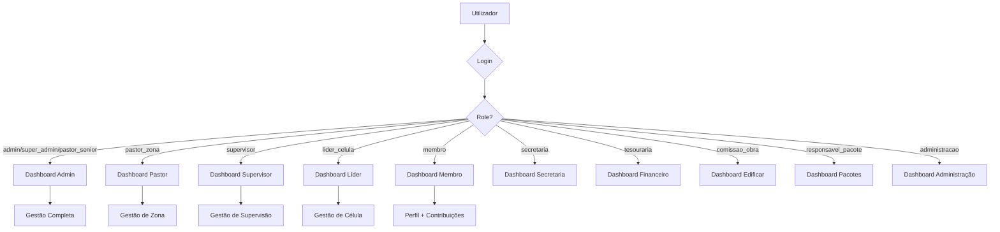

# PROJECT OVERVIEW — Life Church Management System

> **Projeto:** Portal Life Church (proj_edificar)  
> **Data da Auditoria:** 2026-07-10  
> **Responsável:** Chief Digital Transformation Architect  
> **Versão do Sistema:** 1.x (Laravel 11)

---

## 1. Objetivo do Sistema

O **Portal Life Church** é um sistema web de **gestão eclesiástica completa** para igrejas que operam no modelo celular. Foi desenvolvido para a **Life Church — Moçambique** e cobre toda a operação administrativa, financeira, pastoral e ministerial da igreja.

O sistema permite:

- Gestão da estrutura hierárquica da igreja (Zonas → Supervisões → Células → Membros)
- Registo e acompanhamento de cultos com presenças e finanças
- Gestão financeira com workflow de validação de contribuições
- Acompanhamento de visitantes com notificação SMS aos líderes
- Escola ministerial com cursos, turmas e presenças
- Relatórios trimestrais de saúde ministerial
- Gestão de eventos e casamentos
- Dashboards personalizados por papel do utilizador
- PWA (Progressive Web App) para acesso mobile

---

## 2. Stack Tecnológica

### Core

| Camada | Tecnologia | Versão |
|--------|-----------|--------|
| **Backend** | Laravel (PHP) | 11.x |
| **PHP** | PHP | ≥ 8.2 |
| **Template Engine** | Blade | (built-in) |
| **Base de Dados** | MySQL / MariaDB | ≥ 5.7 / ≥ 10.3 |
| **Build Tool** | Vite | 5.x |
| **CSS Framework** | TailwindCSS | 3.1+ (via PostCSS) |
| **JS Framework** | Alpine.js | 3.4+ |

### Dependências Frontend

| Biblioteca | Função | Instalação |
|-----------|--------|------------|
| Bootstrap Icons | Iconografia | npm |
| Chart.js | Gráficos e dashboards | npm |
| SweetAlert2 | Notificações e diálogos | npm |
| Tom Select | Dropdowns pesquisáveis | npm |

### Dependências Backend

| Biblioteca | Função |
|-----------|--------|
| Laravel Breeze | Scaffolding de autenticação |
| DomPDF | Geração de PDFs |
| Maatwebsite Excel | Exportação para Excel |
| httpSMS | Envio de SMS (Moçambique) |

### Infraestrutura

| Componente | Detalhe |
|-----------|---------|
| **Servidor** | Oracle Cloud (146.235.224.99) |
| **URL Produção** | `http://146.235.224.99/edificar/` |
| **PWA** | Service Worker manual |
| **Sessões** | Database (tabela `sessions`) |
| **Cache** | File-based |
| **Queue** | Sync (não configurada) |

---

## 3. Arquitetura

### Padrão Arquitetural

O sistema segue o padrão **MVC (Model-View-Controller)** do Laravel com as seguintes extensões:

- **Policies** para autorização granular
- **Middleware** customizado para controlo de acesso por role
- **View Composers** para dados globais partilhados
- **Service Layer** (parcial — apenas SMS)
- **Exports** para geração de relatórios Excel
- **Notifications** para alertas internos
- **Eloquent Observers** (no model `Visitor` para SMS automático)

### Padrões de Desenvolvimento Identificados

| Padrão | Uso no Projeto |
|--------|---------------|
| MVC | Toda a aplicação |
| Repository | ❌ Não utilizado (queries diretas nos controllers) |
| Service Layer | Parcial (apenas `SmsService`) |
| Observer | `Visitor::booted()` para notificações SMS |
| Singleton | `Setting::get()` com cache |
| Memoization | `User` model (zones, supervisions, contributions) |
| View Composer | `AppServiceProvider` — dados globais |
| Policy | 9 policies para autorização |
| Form Request | 1 (`ProfileUpdateRequest`) — sub-utilizado |
| Strategy | SMS providers (Interface + Implementações) |

---

## 4. Organização de Pastas

```
proj_edificar/
├── app/
│   ├── Console/               # Comandos Artisan (vazio)
│   ├── Exports/               # 14 classes de exportação Excel
│   ├── Http/
│   │   ├── Controllers/       # 44 controllers organizados por domínio
│   │   │   ├── Admin/         # 12 controllers administrativos
│   │   │   ├── Auth/          # 9 controllers de autenticação (Breeze)
│   │   │   ├── Contribution/  # 1 controller de contribuições
│   │   │   ├── Dashboard/     # 8 controllers de dashboards por role
│   │   │   └── Report/        # 1 controller de relatórios
│   │   ├── Middleware/        # 4 middleware customizados
│   │   └── Requests/          # 1 Form Request (sub-utilizado)
│   ├── Models/                # 36 Eloquent models
│   │   └── Concerns/         # 2 traits (NormalizesMozPhone, LogsActivity)
│   ├── Notifications/         # 13 classes de notificação
│   ├── Policies/              # 9 authorization policies
│   ├── Providers/             # 1 service provider (AppServiceProvider)
│   ├── Services/              # 1 serviço (SMS)
│   │   └── Sms/              # 5 classes SMS (interface + 3 providers + service)
│   └── View/                  # Vazio
├── bootstrap/                 # Configuração da app + middleware aliases
├── config/                    # 11 ficheiros de configuração
├── database/
│   ├── migrations/            # 91 migrations
│   ├── seeders/               # 19 seeders
│   └── factories/             # Factories (padrão Laravel)
├── docs/                      # Documentação técnica (esta pasta)
├── public/                    # Assets públicos + index.php
├── resources/
│   ├── css/                   # app.css + layout.css (design tokens)
│   ├── js/                    # app.js + layout.js + pwa.js
│   └── views/                 # ~25 directórios de views Blade
│       ├── admin/             # 13 módulos administrativos
│       ├── auth/              # Views de autenticação
│       ├── components/        # 20 componentes Blade reutilizáveis
│       ├── dashboard/         # 7 dashboards por role
│       ├── layouts/           # Layouts + partials
│       └── ...                # Módulos individuais
├── routes/
│   ├── web.php                # ~517 linhas de rotas web
│   ├── auth.php               # Rotas de autenticação (Breeze)
│   └── console.php            # Rotas de console
├── storage/                   # Logs, uploads, cache
├── tests/                     # Testes (existente mas limitado)
├── .ai/                       # Memória operacional AI (contexto, changelog)
└── .env                       # Variáveis de ambiente
```

---

## 5. Sistema de Roles (Papéis)

O sistema define **13 roles** com hierarquia de acesso:

| Role | Código | Dashboard | Nível de Acesso |
|------|--------|-----------|----------------|
| Super Admin | `super_admin` | Admin | Acesso total, irrestrito |
| Admin | `admin` | Admin | Acesso total |
| Pastor Senior | `pastor_senior` | Admin | Acesso total |
| Pastor | `pastor` | — | Visão pastoral ampla |
| Pastor de Zona | `pastor_zona` | Pastor | Gestão de zona específica |
| Supervisor | `supervisor` | Supervisor | Gestão de supervisão |
| Sub-Supervisor | `sub_supervisor` | — | Assistente de supervisor |
| Líder de Célula | `lider_celula` | Líder | Gestão de célula |
| Timóteo | `timoteo` | — | Discípulo em formação |
| Membro | `membro` | Membro | Acesso pessoal limitado |
| Secretaria | `secretaria` | Secretaria | Gestão administrativa |
| Tesouraria | `tesouraria` | Financeiro | Gestão financeira |
| Administração | `administracao` | Administração | Administração geral |
| Comissão de Obra | `comissao_obra` | Edificar | Projeto Edificar |
| Responsável Pacote | `responsavel_pacote` | Pacotes | Gestão de pacotes |

> **Nota:** Os roles `secretaria` e `tesouraria` têm acesso cruzado (secretaria vê tesouraria e vice-versa).

---

## 6. Módulos Funcionais

O sistema está organizado em **15 módulos** principais:

| # | Módulo | Descrição |
|---|--------|-----------|
| 1 | **Autenticação** | Login, registo, reset de password |
| 2 | **Dashboards** | 8 dashboards personalizados por role |
| 3 | **Zonas** | Gestão de zonas geográficas |
| 4 | **Supervisões** | Gestão de supervisões dentro de zonas |
| 5 | **Células** | Gestão de células, membros, ficha guia |
| 6 | **Membros** | Cadastro e acompanhamento |
| 7 | **Visitantes** | Registo, atribuição, acompanhamento, SMS |
| 8 | **Cultos** | Relatórios de cultos com finanças e presenças |
| 9 | **Encontros de Célula** | Registo de reuniões semanais |
| 10 | **Contribuições** | Dízimos/ofertas com workflow de validação |
| 11 | **Pacotes (Edificar)** | Compromissos financeiros por pacotes |
| 12 | **Eventos** | Calendário de eventos e cerimónias |
| 13 | **Casamentos** | Gestão de casamentos |
| 14 | **Escola Ministerial** | Cursos, turmas, inscrições, presenças |
| 15 | **Relatórios** | Trimestrais, financeiros, exportações |
| 16 | **Configurações** | Settings, backup, formulários públicos |
| 17 | **Notificações** | Sistema interno de alertas |
| 18 | **Inventário** | Bens eclesiásticos |
| 19 | **Requisições/Despesas** | Gestão financeira operacional |

---

## 7. Fluxos Principais



---

## 8. Integrações Externas

| Integração | Provedor | Utilização |
|-----------|----------|-----------|
| SMS | httpSMS | Notificação automática a líderes sobre visitantes |
| PDF | DomPDF | Geração de relatórios em PDF |
| Excel | Maatwebsite | Exportação de dados para Excel |
| PWA | Service Worker | Acesso offline e instalação mobile |

---

## 9. Convenções de Código

| Aspeto | Convenção |
|--------|----------|
| Idioma do código | Inglês (variáveis, métodos) |
| Idioma do domínio | Português/Inglês misto (routes, labels) |
| Naming Models | PascalCase (`CommitmentPackage`) |
| Naming Controllers | PascalCase + `Controller` suffix |
| Naming Views | snake_case em directórios temáticos |
| Naming Routes | dot.notation (`zones.index`, `contributions.store`) |
| Naming Migrations | Laravel default com timestamps |
| CSS | TailwindCSS utility classes + Design Tokens em CSS Variables |
| JavaScript | Alpine.js inline + módulos em `resources/js/` |
