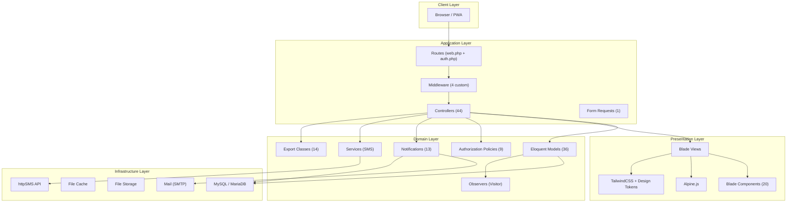
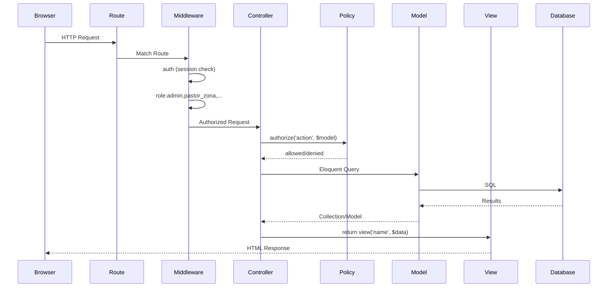
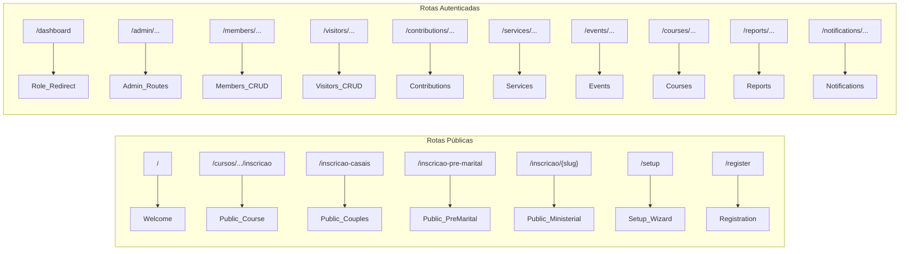
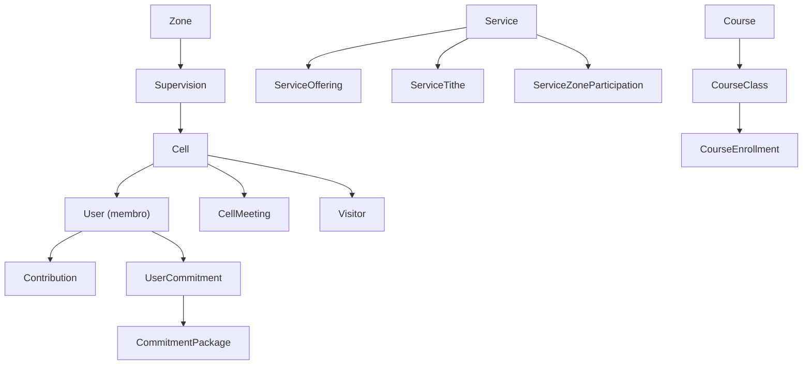
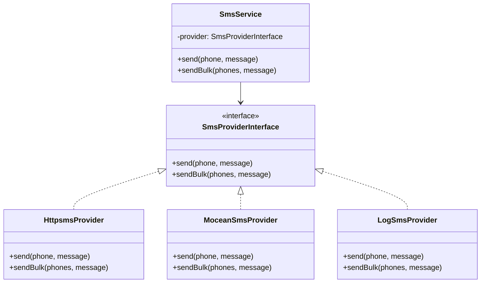
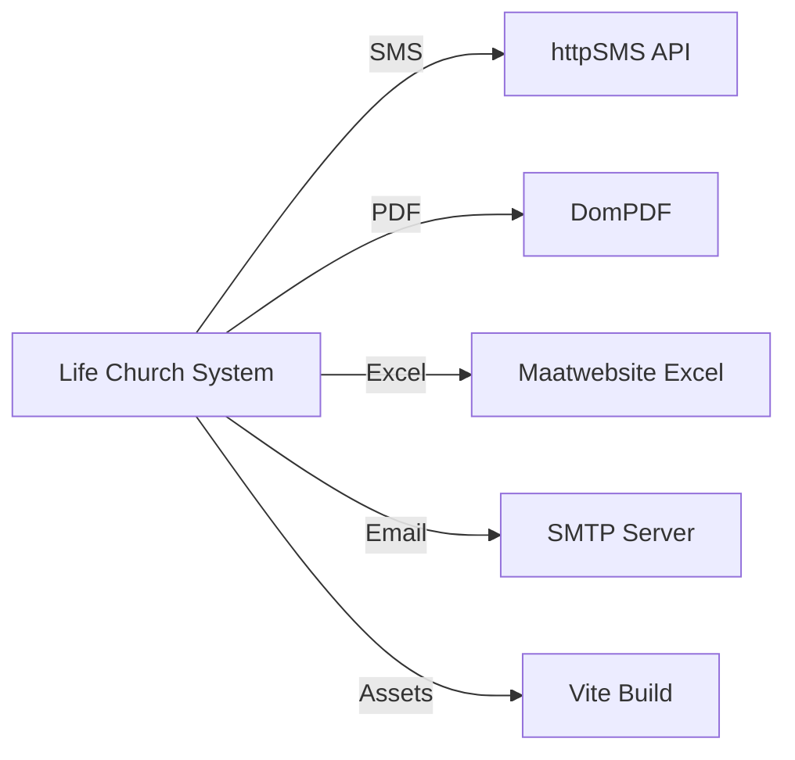

# ARCHITECTURE — Life Church Management System

> **Data:** 2026-07-10 | **Responsável:** Chief Digital Transformation Architect

---

## 1. Visão Geral da Arquitetura

O sistema segue o padrão **MVC (Model-View-Controller)** nativo do Laravel, com extensões de camadas adicionais para autorização, notificação e exportação.



---

## 2. Fluxo de Request HTTP



---

## 3. Camadas do Sistema

### 3.1 Routing Layer

| Ficheiro | Linhas | Função |
|---------|--------|--------|
| `routes/web.php` | 517 | Todas as rotas web (~200+ endpoints) |
| `routes/auth.php` | ~70 | Rotas de autenticação (Breeze) |
| `routes/console.php` | ~5 | Comandos artisan (vazio) |

**Organização das Rotas:**



### 3.2 Middleware Layer

| Middleware | Alias | Função |
|-----------|-------|--------|
| `CheckRole` | `role` | Verifica se o utilizador tem um dos roles permitidos |
| `RedirectBasedOnRole` | `redirect.role` | Redireciona `/` para o dashboard correto |
| `CheckNotAdmin` | `not.admin` | Bloqueia admins de aceder a áreas restritas |
| `CheckSetupCompleted` | — | Redireciona para `/setup` se sistema não configurado |

**Fluxo de Autorização:**

```mermaid
graph LR
    Request --> Auth["auth middleware"]
    Auth -->|Autenticado| Role["role middleware"]
    Auth -->|Não autenticado| Login["/login"]
    Role -->|hasRole()| Controller
    Role -->|Sem permissão| Abort403["403 Forbidden"]
    Controller -->|Policy check| Action
```

> **Nota Crítica:** O `hasRole()` no model `User` concede acesso total a `super_admin`, `admin` e `pastor_senior` independentemente do role solicitado. Isto é um "super-role" implícito.

### 3.3 Controller Layer

| Directório | Nº Controllers | Responsabilidade |
|-----------|---------------|-----------------|
| `Controllers/` | 15 | Módulos principais |
| `Controllers/Admin/` | 12 | Gestão administrativa |
| `Controllers/Auth/` | 9 | Autenticação (Breeze) |
| `Controllers/Contribution/` | 1 | Contribuições financeiras |
| `Controllers/Dashboard/` | 8 | Dashboards por role |
| `Controllers/Report/` | 1 | Relatórios consolidados |
| **Total** | **44** | — |

**Controllers mais complexos (por tamanho):**

| Controller | Bytes | Linhas Est. | Risco |
|-----------|-------|------------|-------|
| `ServiceController` | 33.381 | ~900+ | 🔴 Alto — monolítico |
| `ContributionController` | 31.815 | ~850+ | 🔴 Alto — monolítico |
| `PackageController` | 27.973 | ~750+ | 🔴 Alto — monolítico |
| `CellMeetingController` | 27.460 | ~730+ | 🟠 Médio-Alto |
| `UserController` | 26.361 | ~700+ | 🟠 Médio-Alto |
| `CourseClassController` | 18.439 | ~500+ | 🟡 Médio |
| `QuarterlyReportController` | 16.167 | ~430+ | 🟡 Médio |
| `ReportController` | 16.399 | ~440+ | 🟡 Médio |

### 3.4 Model Layer

**36 Models Eloquent** organizados num único directório com 2 Concerns (traits):

| Concern/Trait | Função |
|--------------|--------|
| `NormalizesMozPhone` | Normaliza telefones moçambicanos (9 ou 12 dígitos) |
| `LogsActivity` | Regista atividades do utilizador (`UserActivity`) |

**Entidades Core:**



### 3.5 Authorization Layer

| Policy | Model | Métodos |
|--------|-------|---------|
| `CellMeetingPolicy` | CellMeeting | viewAny, view, create, update, delete |
| `CellPolicy` | Cell | viewAny, view, create, update, delete |
| `ContributionPolicy` | Contribution | viewAny, view, create, update, delete |
| `EventPolicy` | Event | viewAny, view, create, update, delete |
| `QuarterlyReportPolicy` | QuarterlyReport | viewAny, view, create, update, delete |
| `ServicePolicy` | Service | viewAny, view, create, update, delete |
| `SupervisionPolicy` | Supervision | viewAny, view, create, update, delete |
| `UserPolicy` | User | viewAny, view, create, update, delete |
| `ZonePolicy` | Zone | viewAny, view, create, update, delete |

**Gates Definidos (AppServiceProvider):**

| Gate | Roles Permitidos |
|------|-----------------|
| `verify-contribution` | admin, secretaria, pastor_zona |

### 3.6 View Layer

```
resources/views/
├── layouts/
│   ├── app.blade.php          # Layout principal (~50 linhas, modularizado)
│   ├── sidebar.blade.php      # Sidebar com navegação
│   ├── partials/
│   │   ├── head.blade.php     # Meta tags, imports
│   │   ├── header.blade.php   # Barra superior
│   │   └── flash-messages.blade.php
│   ├── admin.blade.php
│   ├── auth.blade.php
│   └── guest.blade.php
├── components/                 # 20 Blade Components
│   ├── button.blade.php       # Botão com loading state
│   ├── card.blade.php         # Card container
│   ├── badge.blade.php        # Badge de status
│   ├── breadcrumbs.blade.php  # Navegação breadcrumb
│   ├── skeleton.blade.php     # Skeleton loader
│   ├── empty-state.blade.php  # Estado vazio
│   ├── text-input-premium.blade.php
│   ├── modal.blade.php
│   └── ... (12 legacy Breeze components)
├── dashboard/                  # 7 dashboards por role
├── admin/                      # 13 módulos admin
│   ├── cells/
│   ├── users/
│   ├── zones/
│   ├── supervisions/
│   ├── packages/
│   ├── settings/
│   └── ...
└── ... (17 mais directórios de módulos)
```

### 3.7 Service Layer

O sistema tem uma **camada de serviço mínima**, limitada ao SMS:



### 3.8 Export Layer

14 classes de exportação para Excel usando `Maatwebsite\Excel`:

| Export Class | Dados Exportados |
|-------------|-----------------|
| `AllClassesExport` | Todas as turmas |
| `AnnualQuarterlyReportExport` | Relatório anual trimestral |
| `CellMeetingsExport` | Encontros de célula |
| `CellReportExport` | Relatório de célula |
| `ChurchStructureExport` | Estrutura da igreja |
| `CourseClassReportExport` | Relatório de turma |
| `GlobalCourseReportExport` | Relatório global de cursos |
| `GlobalReportExport` | Relatório global |
| `PackageMembersExport` | Membros de pacotes |
| `QuarterlyReportExport` | Relatório trimestral |
| `ServicesExport` | Cultos |
| `SupervisionReportExport` | Relatório de supervisão |
| `VisitorsExport` | Visitantes |
| `ZoneReportExport` | Relatório de zona |

### 3.9 Notification Layer

13 classes de notificação via database channel:

| Notificação | Gatilho |
|------------|---------|
| `AdminPasswordResetNotification` | Reset de password por admin |
| `CommitmentChosenNotification` | Membro escolhe pacote |
| `CommitmentExpiringNotification` | Compromisso a expirar |
| `ContributionCreatedNotification` | Nova contribuição criada |
| `ContributionPendingValidationNotification` | Contribuição pendente |
| `ContributionRejectedForManagerNotification` | Rejeição (para gestor) |
| `ContributionRejectedNotification` | Rejeição (para membro) |
| `ContributionVerifiedForManagerNotification` | Verificação (para gestor) |
| `ContributionVerifiedNotification` | Verificação (para membro) |
| `MemberAddedToCellNotification` | Membro adicionado a célula |
| `MemberCreatedNotification` | Novo membro criado |
| `PendingContributionsNotification` | Contribuições pendentes |
| `UserPromotedNotification` | Promoção de utilizador |

---

## 4. Configuração e Bootstrap

### Middleware Aliases (`bootstrap/app.php`)

```php
$middleware->alias([
    'role' => CheckRole::class,
    'redirect.role' => RedirectBasedOnRole::class,
    'not.admin' => CheckNotAdmin::class,
]);
```

### View Composer Global (`AppServiceProvider`)

Dados partilhados com **todas** as views em cada request:

| Variável | Conteúdo |
|---------|----------|
| `$authUser` | Instância do utilizador autenticado |
| `$role` | Role do utilizador |
| `$unreadNotifications` | Contagem de notificações não lidas |
| `$pendingCount` | Contagem de contribuições pendentes |

> **Nota:** Utiliza cache estático (`static $cachedData`) para evitar queries repetidas por request.

---

## 5. Pontos de Integração



---

## 6. Decisões Arquiteturais Relevantes

| Decisão | Justificação |
|---------|-------------|
| TailwindCSS em vez de Bootstrap | Projeto já em Tailwind; mais flexível para design systems |
| Alpine.js em vez de Vue/React | Leve (~15KB), suficiente para as interações |
| Sem API REST separada | Aplicação server-side; não há mobile app nativo |
| Sem Queue | SMS e notificações são síncronas (risco de latência) |
| Roles em enum no DB | Simplicidade; sem tabela de roles separada |
| Sidebar sempre preta | Contraste profissional, padrão SaaS moderno |
| Meses financeiros 20-5 | Ciclo de contribuições do dia 20 ao dia 5 seguinte |
