# DATABASE — Life Church Management System

> **Data:** 2026-07-10 | **Responsável:** Chief Digital Transformation Architect  
> **Motor:** MySQL / MariaDB | **Migrations:** 91 ficheiros

---

## 1. Diagrama Entidade-Relacionamento

```mermaid
erDiagram
    %% ===== HIERARQUIA ECLESIÁSTICA =====
    zones ||--o{ supervisions : "tem"
    zones ||--o{ contributions : "recebe"
    zones ||--o{ quarterly_reports : "gera"
    zones ||--o{ events : "organiza"
    zones ||--o{ visitors : "recebe"
    zones }o--|| users : "pastor_id"

    supervisions ||--o{ cells : "contém"
    supervisions ||--o{ contributions : "recebe"
    supervisions }o--|| users : "supervisor_id"
    supervisions }o--o| users : "sub_supervisor_id"

    cells ||--o{ users : "membros (cell_id)"
    cells ||--o{ cell_meetings : "encontros"
    cells ||--o{ contributions : "gera"
    cells ||--o{ visitors : "recebe"
    cells ||--o{ discipleships : "discipulados"
    cells ||--o{ conversions : "conversões"
    cells ||--o{ events : "eventos"
    cells }o--o| users : "leader_id"
    cells }o--o| users : "timoteo_id"

    %% ===== UTILIZADORES =====
    users ||--o{ contributions : "faz"
    users ||--o{ user_commitments : "compromete"
    users ||--o{ course_enrollments : "inscreve"
    users ||--o{ notifications : "recebe"
    users ||--o{ user_activities : "regista"

    %% ===== FINANCEIRO =====
    commitment_packages ||--o{ user_commitments : "agrupa"
    commitment_packages ||--o{ contributions : "package_id"

    contributions }o--o| users : "verified_by"

    %% ===== CULTOS =====
    services ||--o{ service_offerings : "ofertas"
    services ||--o{ service_tithes : "dízimos"
    services ||--o{ service_individual_offerings : "ofertas individuais"
    services ||--o{ service_zone_participations : "presenças por zona"
    services }o--o| users : "preacher_id"

    service_offerings }o--|| offering_types : "tipo"

    %% ===== ESCOLA MINISTERIAL =====
    courses ||--o{ course_classes : "turmas"
    courses ||--o{ course_enrollments : "inscrições"

    course_classes ||--o{ course_class_meetings : "aulas"
    course_classes ||--o{ course_class_attendance : "presenças"
    course_classes }o--o| users : "leader_husband_id"
    course_classes }o--o| users : "leader_wife_id"

    course_enrollments }o--|| users : "user_id"
    course_enrollments }o--o| course_classes : "turma"

    %% ===== CASAIS =====
    couple_enrollments }o--o| course_classes : "turma"

    %% ===== INSCRIÇÕES MINISTERIAIS =====
    ministerial_enrollments }o--|| courses : "curso"

    %% ===== EVENTOS =====
    events }o--|| event_types : "tipo"
    events }o--o| zones : "zona"
    events }o--o| cells : "célula"

    weddings }o--o| events : "evento"

    %% ===== RELATÓRIOS =====
    quarterly_reports }o--|| zones : "zona"
    quarterly_reports }o--o| supervisions : "supervisão"
    quarterly_reports }o--|| users : "supervisor_id"
    quarterly_reports }o--o| users : "zone_pastor_id"
    quarterly_reports ||--o{ quarterly_report_events : "eventos"

    %% ===== ENCONTROS =====
    cell_meetings }o--|| cells : "célula"
    cell_meetings }o--o| users : "leader_id"
    cell_meetings }o--o| zones : "zone_id"
    cell_meetings }o--o| supervisions : "supervision_id"

    %% ===== FINANCEIRO OPERACIONAL =====
    requisitions }o--|| users : "requester"
    expenses }o--o| requisitions : "requisição"

    %% ===== INVENTÁRIO =====
    inventory_items }o--o| users : "responsible"

    %% ===== CONFIGURAÇÕES =====
    settings ||--|| settings : "key-value"
```

---

## 2. Tabelas do Sistema

### 2.1 Tabelas Core (Hierarquia Eclesiástica)

#### `zones` — Zonas Geográficas

| Coluna | Tipo | Restrições | Descrição |
|--------|------|-----------|-----------|
| id | bigint | PK, auto | Identificador |
| name | varchar | unique | Nome da zona |
| description | text | nullable | Descrição |
| pastor_id | bigint | FK → users, nullable | Pastor responsável |
| is_active | boolean | default true | Estado activo |
| show_in_teaching_services | boolean | default false | Visível em cultos de ensino |
| created_at/updated_at | timestamp | — | Timestamps |

#### `supervisions` — Supervisões

| Coluna | Tipo | Restrições | Descrição |
|--------|------|-----------|-----------|
| id | bigint | PK, auto | Identificador |
| name | varchar | unique(name, zone_id) | Nome |
| zone_id | bigint | FK → zones, cascade | Zona pai |
| supervisor_id | bigint | FK → users, nullable | Supervisor |
| sub_supervisor_id | bigint | FK → users, nullable | Sub-supervisor |
| is_active | boolean | default true | Estado activo |
| description | text | nullable | Descrição |

#### `cells` — Células

| Coluna | Tipo | Restrições | Descrição |
|--------|------|-----------|-----------|
| id | bigint | PK, auto | Identificador |
| name | varchar | unique(name, supervision_id) | Nome |
| supervision_id | bigint | FK → supervisions, cascade | Supervisão pai |
| leader_id | bigint | FK → users, set null | Líder |
| timoteo_id | bigint | FK → users, set null | Discípulo Timóteo |
| member_count | integer | default 0 | Contagem (desnormalizado) |

#### `users` — Utilizadores / Membros

| Coluna | Tipo | Restrições | Descrição |
|--------|------|-----------|-----------|
| id | bigint | PK, auto | Identificador |
| name | varchar | — | Nome completo |
| email | varchar | unique | Email |
| phone | varchar | nullable | Telefone (normalizado) |
| password | varchar | hashed | Password |
| role | enum | default 'membro' | Papel no sistema |
| cell_id | bigint | FK → cells, set null | Célula a que pertence |
| is_active | boolean | default true | Estado activo |
| observations | text | nullable | Notas |
| notification_preferences | json | nullable | Preferências de notificação |
| menu_permissions | json | nullable | Permissões de menu customizadas |
| last_login_at | datetime | nullable | Último login |
| email_verified_at | timestamp | nullable | Verificação de email |

**Roles enum (evolução via migrations):** `membro`, `lider_celula`, `supervisor`, `sub_supervisor`, `pastor_zona`, `admin`, `super_admin`, `pastor_senior`, `pastor`, `secretaria`, `tesouraria`, `comissao_obra`, `responsavel_pacote`, `administracao`, `timoteo`

---

### 2.2 Tabelas Financeiras

#### `commitment_packages` — Pacotes de Compromisso (Projeto Edificar)

| Coluna | Tipo | Restrições | Descrição |
|--------|------|-----------|-----------|
| id | bigint | PK | Identificador |
| name | varchar | unique | Nome do pacote |
| min_amount | decimal(10,2) | — | Valor mínimo |
| max_amount | decimal(10,2) | nullable | Valor máximo (null = sem limite) |
| description | text | nullable | Descrição |
| whatsapp_link | varchar | nullable | Link WhatsApp do grupo |
| sms_template | text | nullable | Template SMS |
| whatsapp_template | text | nullable | Template WhatsApp |
| responsible_id | bigint | FK → users, nullable | Responsável do pacote |
| is_active | boolean | default true | Estado |
| order | integer | default 0 | Ordenação |

#### `user_commitments` — Compromissos de Membros

| Coluna | Tipo | Restrições | Descrição |
|--------|------|-----------|-----------|
| id | bigint | PK | Identificador |
| user_id | bigint | FK → users, cascade | Membro |
| package_id | bigint | FK → commitment_packages, restrict | Pacote |
| start_date | date | — | Data de início |
| end_date | date | nullable | Data de fim (null = activo) |

#### `contributions` — Contribuições (Dízimos/Ofertas Edificar)

| Coluna | Tipo | Restrições | Descrição |
|--------|------|-----------|-----------|
| id | bigint | PK | Identificador |
| user_id | bigint | FK → users, cascade | Contribuinte |
| cell_id | bigint | FK → cells, restrict | Célula |
| supervision_id | bigint | FK → supervisions, restrict | Supervisão |
| zone_id | bigint | FK → zones, restrict | Zona |
| package_id | bigint | FK → commitment_packages, nullable | Pacote (null = eclesiástico) |
| amount | decimal(10,2) | — | Valor |
| contribution_date | date | indexed | Data da contribuição |
| proof_path | varchar | nullable | Comprovativo (ficheiro) |
| proof_message | text | nullable | Mensagem do comprovativo |
| status | enum | default 'pendente' | `pendente`, `verificada`, `rejeitada`, `cancelada` |
| verified_by | bigint | FK → users, nullable | Quem verificou |
| verified_at | datetime | nullable | Quando verificou |
| rejection_reason | text | nullable | Motivo da rejeição |
| notes | text | nullable | Notas |

**Índices:** user_id, cell_id, zone_id, contribution_date, status

---

### 2.3 Tabelas de Cultos

#### `services` — Cultos

| Coluna | Tipo | Restrições | Descrição |
|--------|------|-----------|-----------|
| id | bigint | PK | — |
| date | date | indexed | Data do culto |
| service_type | enum | indexed | `1st`, `2nd`, `3rd`, `4th`, `special`, `teaching` |
| preacher_id | bigint | FK → users, nullable | Pregador (utilizador) |
| preacher_name | varchar | nullable | Nome do pregador (externo) |
| theme | varchar | nullable | Tema |
| message | text | nullable | Resumo da mensagem |
| observations | text | nullable | Observações |
| adults_members | integer | default 0 | Membros adultos |
| adults_visitors | integer | default 0 | Visitantes adultos |
| adults_salvations | integer | default 0 | Salvações adultas |
| children_members | integer | default 0 | Membros crianças |
| children_visitors | integer | default 0 | Visitantes crianças |
| children_salvations | integer | default 0 | Salvações crianças |
| special_offerings_total | decimal(10,2) | default 0 | Ofertas especiais |

#### `service_offerings` — Ofertas por Tipo

| Coluna | Tipo | Restrições |
|--------|------|-----------|
| id | bigint | PK |
| service_id | bigint | FK → services, cascade |
| offering_type_id | bigint | FK → offering_types, restrict |
| amount | decimal(10,2) | default 0 |
| notes | text | nullable |

#### `service_tithes` — Dízimos do Culto

| Coluna | Tipo | Restrições |
|--------|------|-----------|
| id | bigint | PK |
| service_id | bigint | FK → services, cascade |
| member_name | varchar | — |
| amount | decimal(10,2) | — |

#### `service_individual_offerings` — Ofertas Individuais

| Coluna | Tipo | Restrições |
|--------|------|-----------|
| id | bigint | PK |
| service_id | bigint | FK → services, cascade |
| name | varchar | — |
| amount | decimal(10,2) | — |

#### `service_zone_participations` — Presenças por Zona (Culto de Ensino)

| Coluna | Tipo | Restrições |
|--------|------|-----------|
| id | bigint | PK |
| service_id | bigint | FK → services, cascade |
| zone_id | bigint | FK → zones |
| adults_members | integer | default 0 |
| children_members | integer | default 0 |
| adults_visitors | integer | default 0 |
| children_visitors | integer | default 0 |
| leaders | integer | default 0 |
| auxiliary_leaders | integer | default 0 |
| supervisors | integer | default 0 |
| zone_pastors | integer | default 0 |

#### `offering_types` — Tipos de Oferta

| Coluna | Tipo | Restrições |
|--------|------|-----------|
| id | bigint | PK |
| name | varchar | unique |
| description | text | nullable |
| is_active | boolean | default true |

---

### 2.4 Tabelas de Encontros e Visitantes

#### `cell_meetings` — Encontros de Célula

| Coluna | Tipo | Restrições |
|--------|------|-----------|
| id | bigint | PK |
| cell_id | bigint | FK → cells, nullable |
| zone_id | bigint | FK → zones, nullable |
| supervision_id | bigint | FK → supervisions, nullable |
| meeting_date | date | unique(cell_id, meeting_date) |
| theme | varchar | nullable |
| leader_id | bigint | FK → users, nullable |
| adults_count | integer | default 0 |
| children_count | integer | default 0 |
| observations | text | nullable |

#### `visitors` — Visitantes

| Coluna | Tipo | Restrições |
|--------|------|-----------|
| id | bigint | PK |
| name | varchar | — |
| age | integer | nullable |
| gender | enum | `masculino`, `feminino`, nullable |
| neighborhood | varchar | nullable |
| city | varchar | default 'Maputo' |
| phone | varchar | nullable |
| invited_by_someone | boolean | default false |
| inviter_name | varchar | nullable |
| visit_date | date | indexed |
| service_id | bigint | FK → services, nullable |
| zone_id | bigint | FK → zones, nullable |
| cell_id | bigint | FK → cells, nullable |
| contact_status | enum | `pendente`, `contatado`, `integrado`, `sem_interesse` |
| contacted_at | datetime | nullable |
| contacted_by | bigint | FK → users, nullable |
| notes | text | nullable |
| created_by | bigint | FK → users, cascade |

**Índices:** visit_date, contact_status, (zone_id + contact_status)

---

### 2.5 Tabelas da Escola Ministerial

#### `courses` — Cursos

| Coluna | Tipo | Restrições |
|--------|------|-----------|
| id | bigint | PK |
| name | varchar | — |
| slug | varchar | unique |
| description | text | nullable |
| category | varchar | nullable |
| duration | varchar | nullable |
| target_role | varchar | nullable |
| is_active | boolean | default true |
| registration_open | boolean | default false |
| registration_deadline | date | nullable |

#### `course_classes` — Turmas

| Coluna | Tipo | Restrições |
|--------|------|-----------|
| id | bigint | PK |
| course_id | bigint | FK → courses, cascade |
| name | varchar | — |
| leader_husband_id | bigint | FK → users, nullable |
| leader_wife_id | bigint | FK → users, nullable |
| status | enum | `active`, `completed`, `cancelled` |
| start_date / end_date | date | nullable |
| (+ campos pré-marital) | — | Campos específicos para cursos pré-maritais |

#### `course_enrollments` — Inscrições em Cursos

| Coluna | Tipo | Restrições |
|--------|------|-----------|
| id | bigint | PK |
| course_id | bigint | FK → courses, cascade |
| user_id | bigint | FK → users, cascade |
| course_class_id | bigint | FK → course_classes, nullable |
| male_partner_id | bigint | FK → users, nullable |
| female_partner_id | bigint | FK → users, nullable |
| status | varchar | default 'enrolled' |
| enrolled_at | timestamp | — |
| completed_at | timestamp | nullable |

#### `couple_enrollments` — Inscrições de Casais

| Coluna | Tipo | Restrições |
|--------|------|-----------|
| id | bigint | PK |
| husband_name / wife_name | varchar | — |
| husband_phone / wife_phone | varchar | nullable |
| course_class_id | bigint | FK → course_classes, nullable |
| status | varchar | default 'pendente' |
| is_church_member | varchar | nullable |
| (+ muitos campos de dados pessoais) | — | Endereço, profissão, etc. |

#### `ministerial_enrollments` — Inscrições Ministeriais

| Coluna | Tipo | Restrições |
|--------|------|-----------|
| id | bigint | PK |
| course_id | bigint | FK → courses |
| full_name | varchar | — |
| email / phone | varchar | — |
| status | varchar | default 'pendente' |

---

### 2.6 Tabelas de Eventos

#### `event_types` — Tipos de Evento

| Coluna | Tipo | Restrições |
|--------|------|-----------|
| id | bigint | PK |
| name | varchar | unique |
| category | varchar | nullable |
| color | varchar | nullable |

#### `events` — Eventos

| Coluna | Tipo | Restrições |
|--------|------|-----------|
| id | bigint | PK |
| event_type_id | bigint | FK → event_types, restrict |
| name | varchar | — |
| date | date | indexed |
| end_date | date | nullable |
| zone_id | bigint | FK → zones, nullable |
| cell_id | bigint | FK → cells, nullable |
| participants_count | integer | default 0 |
| description / observations | text | nullable |

#### `weddings` — Casamentos

| Coluna | Tipo | Restrições |
|--------|------|-----------|
| id | bigint | PK |
| couple_enrollment_id | bigint | FK, nullable |
| event_id | bigint | FK → events, nullable |
| wedding_date | date | — |
| status | varchar | — |

---

### 2.7 Tabelas de Relatórios

#### `quarterly_reports` — Relatórios Trimestrais

| Coluna | Tipo | Restrições |
|--------|------|-----------|
| id | bigint | PK |
| zone_id | bigint | FK → zones, cascade |
| supervision_id | bigint | FK → supervisions, nullable |
| supervisor_id | bigint | FK → users, restrict |
| zone_pastor_id | bigint | FK → users, nullable |
| year | integer | — |
| quarter | tinyint | 1-4 |
| leaders_count ... closed_cells_count | integer | default 0 (12+ métricas) |
| discipleship_score ... prayer_intercession_score | tinyint | 0-3 (7 scores qualitativos) |
| ministerial_observations | text | nullable |
| evangelism_strategy ... visitation_routine | text | nullable (campos adicionais) |
| status | enum | `draft`, `submitted`, `approved` |
| submitted_at | timestamp | nullable |

**Unique:** (zone_id, year, quarter)

---

### 2.8 Tabelas de Suporte

#### `settings` — Configurações do Sistema

| Coluna | Tipo | Restrições |
|--------|------|-----------|
| id | bigint | PK |
| key | varchar | unique |
| value | text | nullable |
| type | enum | `string`, `integer`, `boolean`, `json`, `file` |
| group | varchar(50) | default 'general' |
| is_public | boolean | default false |

#### `user_activities` — Log de Actividades

| Coluna | Tipo | Restrições |
|--------|------|-----------|
| id | bigint | PK |
| user_id | bigint | FK → users |
| action | varchar | — |
| description | text | nullable |
| ip_address | varchar | nullable |
| user_agent | text | nullable |
| metadata | json | nullable |

#### `notifications` — Notificações (Laravel)

Tabela padrão do Laravel para notificações persistentes (database channel).

#### `inventory_items` — Inventário

| Coluna | Tipo | Restrições |
|--------|------|-----------|
| id | bigint | PK |
| name | varchar | — |
| category | varchar | nullable |
| quantity | integer | default 0 |
| condition | varchar | nullable |
| location | varchar | nullable |

#### `requisitions` — Requisições Financeiras

| Coluna | Tipo | Restrições |
|--------|------|-----------|
| id | bigint | PK |
| user_id | bigint | FK → users |
| description | text | — |
| amount | decimal(10,2) | — |
| status | enum | `pending`, `approved`, `rejected` |
| scope | varchar | nullable |

#### `expenses` — Despesas

| Coluna | Tipo | Restrições |
|--------|------|-----------|
| id | bigint | PK |
| description | text | — |
| amount | decimal(10,2) | — |
| expense_date | date | — |
| requisition_id | bigint | FK, nullable |
| scope | varchar | nullable |

---

## 3. Resumo de Tabelas

| Domínio | Tabelas | Quantidade |
|---------|---------|-----------|
| Hierarquia Eclesiástica | zones, supervisions, cells | 3 |
| Utilizadores | users, sessions, password_reset_tokens | 3 |
| Financeiro Edificar | commitment_packages, user_commitments, contributions | 3 |
| Cultos | services, service_offerings, service_tithes, service_individual_offerings, service_zone_participations, offering_types | 6 |
| Encontros | cell_meetings, cell_meeting_participants, attendances, cell_visitors | 4 |
| Visitantes | visitors | 1 |
| Discipulado | discipleships, conversions | 2 |
| Escola Ministerial | courses, course_classes, course_enrollments, course_class_meetings, course_class_attendance, couple_enrollments, ministerial_enrollments | 7 |
| Eventos | events, event_types, weddings | 3 |
| Relatórios | quarterly_reports, quarterly_report_events | 2 |
| Financeiro Operacional | requisitions, expenses | 2 |
| Sistema | settings, notifications, user_activities, inventory_items, cache, jobs, job_batches, failed_jobs | 8 |
| **Total** | — | **~44 tabelas** |

---

## 4. Observações e Oportunidades

> [!WARNING]
> ### Inconsistências Identificadas
> 1. **Migration do `contributions`** define `status` como `enum('pendente','verificada','rejeitada')`, mas o model usa `'pending'` nos scopes — e migrations posteriores adicionam `'cancelada'`
> 2. **Coluna `registered_by_id`** na migration de contributions, mas o model referencia `user_id` — possível coluna órfã
> 3. **91 migrations** com muitas alterações incrementais. Considerar consolidação para novos deploys

> [!NOTE]
> ### Possíveis Melhorias
> 1. **Consolidação de migrations** — 91 ficheiros poderiam ser reduzidos com `migrate:fresh` + seeders optimizados
> 2. **Índices compostos** — Tabelas de contribuições e serviços beneficiariam de índices multi-coluna
> 3. **Soft Deletes** — Nenhuma tabela usa soft deletes; dados deletados são permanentemente perdidos
> 4. **Coluna `member_count` em `cells`** é desnormalizada e potencialmente desactualizada
> 5. **Enum roles no users** é difícil de estender; considerar tabela de roles separada
