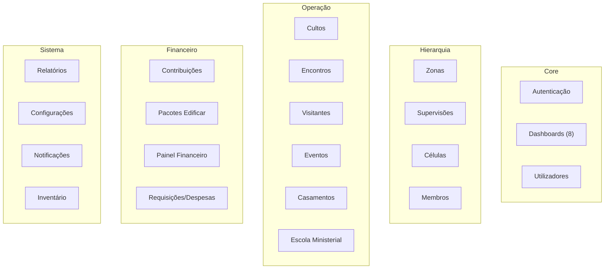

# MODULES — Life Church Management System

> **Data:** 2026-07-10 | **Total:** 19 módulos funcionais

---

## Visão Geral dos Módulos

---

## Módulo 1: Autenticação

| Aspeto | Detalhe |
|--------|---------|
| **Controller** | Auth/* (9 controllers — Laravel Breeze) |
| **Views** | `resources/views/auth/` |
| **Funcionalidades** | Login, Logout, Register, Reset Password, Email Verification |
| **Middleware** | `guest` (público), `auth` (protegido) |
| **Notas** | Registo público controlado; auto-registo cria membros com role `membro` |

---

## Módulo 2: Dashboards

| Dashboard | Controller | Role | View |
|-----------|-----------|------|------|
| Admin | AdminDashboardController | super_admin, admin, pastor_senior | dashboard/admin.blade.php (30KB) |
| Pastor | PastorDashboardController | pastor_zona | dashboard/pastor.blade.php (25KB) |
| Supervisor | SupervisorDashboardController | supervisor | dashboard/supervisor.blade.php (17KB) |
| Líder | LiderDashboardController | lider_celula | dashboard/lider.blade.php (19KB) |
| Membro | MemberDashboardController | membro | dashboard/membro.blade.php (26KB) |
| Secretaria | SecretaryDashboardController | secretaria | dashboard/secretaria.blade.php (13KB) |
| Administração | AdministracaoDashboardController | administracao | dashboard/administracao.blade.php (21KB) |
| Pacotes | PackageManagerDashboardController | responsavel_pacote | (dentro de packages) |

**Total:** 8 dashboards personalizados, cada um com métricas específicas do papel.

---

## Módulo 3: Zonas

| Aspeto | Detalhe |
|--------|---------|
| **Controller** | Admin\ZoneController |
| **Model** | Zone |
| **Views** | `admin/zones/` (index, show, create, edit, merge) |
| **Funcionalidades** | CRUD + Merge de zonas + Bulk delete |
| **Permissões** | Read: amplo; Write: super_admin, admin, secretaria |
| **Relações** | Tem pastor, supervisões, células (through), contribuições, eventos, relatórios |

---

## Módulo 4: Supervisões

| Aspeto | Detalhe |
|--------|---------|
| **Controller** | Admin\SupervisionController |
| **Model** | Supervision |
| **Views** | `admin/supervisions/` |
| **Funcionalidades** | CRUD + Merge + Reassign Zone + Quick Supervisor + Bulk delete |
| **Relações** | Pertence a Zone, tem Cells, Supervisor, Sub-Supervisor |

---

## Módulo 5: Células

| Aspeto | Detalhe |
|--------|---------|
| **Controller** | Admin\CellController (~11KB), AttendanceController |
| **Model** | Cell |
| **Views** | `admin/cells/` |
| **Funcionalidades** | CRUD + Ficha Guia (show) + PDF + Attendance + Visitors + Discipleships + Conversions + Reassign + Assign Timoteo + Bulk delete |
| **Sub-módulos** | Presenças, Visitantes da célula, Discipulados, Conversões |
| **Relações** | Pertence a Supervision, tem Leader, Timoteo, Members, Meetings, Contributions, Visitors |

---

## Módulo 6: Membros

| Aspeto | Detalhe |
|--------|---------|
| **Controller** | Admin\UserController (context methods) |
| **Model** | User |
| **Views** | `members/` |
| **Funcionalidades** | CRUD contextualizado (membros filtrados), Bulk delete |
| **Notas** | Partilha controller com Users mas com métodos separados (`*FromContext`) |

---

## Módulo 7: Visitantes

| Aspeto | Detalhe |
|--------|---------|
| **Controller** | VisitorController |
| **Model** | Visitor |
| **Views** | `visitors/` |
| **Funcionalidades** | CRUD + Assign Zone + Assign Cell + Mark Contacted + Export Excel + Bulk delete + SMS automático |
| **Integrações** | httpSMS para notificação ao líder da célula |
| **Observer** | `Visitor::booted()` — dispara SMS quando `cell_id` é definido |

---

## Módulo 8: Cultos (Services)

| Aspeto | Detalhe |
|--------|---------|
| **Controller** | ServiceController (~33KB — o maior do sistema) |
| **Model** | Service + ServiceOffering + ServiceTithe + ServiceIndividualOffering + ServiceZoneParticipation |
| **Views** | `services/` + `admin/services/` |
| **Funcionalidades** | CRUD + Teaching Services + PDF + Reports (mensal/trimestral/anual/custom) + Export Excel + Bulk delete |
| **Tipos** | Regular (1st-4th, special) e Teaching (com presenças por zona) |
| **Finanças** | Dízimos, ofertas por tipo, ofertas individuais, ofertas especiais |

---

## Módulo 9: Encontros de Célula

| Aspeto | Detalhe |
|--------|---------|
| **Controller** | CellMeetingController (~27KB) |
| **Model** | CellMeeting |
| **Views** | `cell_meetings/` |
| **Funcionalidades** | CRUD + PDF + Email + Export Excel + Bulk delete + Participants (many-to-many) |
| **Tipos** | normal, leadership, supervision, zone, general, other |

---

## Módulo 10: Contribuições

| Aspeto | Detalhe |
|--------|---------|
| **Controller** | Contribution\ContributionController (~32KB) |
| **Model** | Contribution |
| **Views** | `contributions/` |
| **Funcionalidades** | CRUD + Workflow (verify/reject/cancel) + Receipt download + Pending list |
| **Workflow** | pendente → verificada / rejeitada / cancelada |
| **Notificações** | 7 notifications associadas ao ciclo de vida |
| **Distinção** | `package_id=null` = eclesiástico; `package_id` preenchido = Edificar |

---

## Módulo 11: Pacotes (Projeto Edificar)

| Aspeto | Detalhe |
|--------|---------|
| **Controller** | Admin\PackageController (~28KB) |
| **Model** | CommitmentPackage + UserCommitment |
| **Views** | `admin/packages/` |
| **Funcionalidades** | CRUD + Assign/Remove Members + Change Package + Bulk SMS + Export (Excel/PDF/WhatsApp) + Quick Member + Dashboard |
| **Integrações** | SMS individual e em massa |

---

## Módulo 12: Eventos

| Aspeto | Detalhe |
|--------|---------|
| **Controller** | EventController |
| **Model** | Event + EventType |
| **Views** | `events/` |
| **Funcionalidades** | CRUD + Calendar Feed (JSON) + PDF + Email + Bulk delete |
| **Categorias** | Dinâmicas via EventType (com cores) |

---

## Módulo 13: Casamentos (Weddings)

| Aspeto | Detalhe |
|--------|---------|
| **Controller** | Admin\WeddingController |
| **Model** | Wedding |
| **Views** | `admin/weddings/` |
| **Funcionalidades** | CRUD + Calendar Feed + PDF + Bulk delete + Test Email |
| **Relação** | Ligado a CoupleEnrollment e Event |

---

## Módulo 14: Escola Ministerial

| Aspeto | Detalhe |
|--------|---------|
| **Controllers** | CourseController, CourseClassController (~18KB), CourseEnrollmentController, CoupleEnrollmentController, MinisterialEnrollmentController |
| **Models** | Course, CourseClass, CourseEnrollment, CoupleEnrollment, MinisterialEnrollment, CourseClassMeeting, CourseClassAttendance |
| **Views** | `courses/`, `course_classes/`, `course_enrollments/`, `couple_enrollments/` |
| **Funcionalidades** | CRUD de cursos/turmas + Attendance + Meetings + Reports + Export + Public enrollment forms + Convert ministerial to user |
| **Formulários Públicos** | Inscrição de casais, pré-marital, ministerial (sem autenticação) |

---

## Módulo 15: Relatórios

| Aspeto | Detalhe |
|--------|---------|
| **Controller** | Report\ReportController (~16KB) |
| **Export Classes** | 14 classes de exportação |
| **Níveis** | Cell, Supervision, Zone, Global |
| **Formatos** | PDF + Excel |
| **Filtros** | Mês, ano, zona, supervisão, célula |

---

## Módulo 16: Relatórios Trimestrais

| Aspeto | Detalhe |
|--------|---------|
| **Controller** | QuarterlyReportController (~16KB) |
| **Model** | QuarterlyReport + QuarterlyReportEvent |
| **Views** | `quarterly_reports/` |
| **Funcionalidades** | CRUD + Export (Excel/PDF/Annual) + Bulk delete |
| **Métricas** | 12+ contagens numéricas + 7 scores qualitativos (0-3) |

---

## Módulo 17: Configurações

| Aspeto | Detalhe |
|--------|---------|
| **Controller** | Admin\SettingController, Admin\PublicFormSettingController |
| **Model** | Setting |
| **Views** | `admin/settings/` |
| **Funcionalidades** | Key-value settings + Logo upload + Backup download + Reset + Public forms config |

---

## Módulo 18: Financeiro Operacional

| Aspeto | Detalhe |
|--------|---------|
| **Controllers** | Admin\RequisitionController, Admin\ExpenseController, FinancialDashboardController |
| **Models** | Requisition, Expense |
| **Views** | `admin/requisitions/`, `admin/expenses/`, `financial_dashboard/` |
| **Funcionalidades** | CRUD + Approve/Reject requisitions + Dashboard consolidado |

---

## Módulo 19: Inventário

| Aspeto | Detalhe |
|--------|---------|
| **Controller** | InventoryItemController |
| **Model** | InventoryItem |
| **Views** | `inventory/` |
| **Funcionalidades** | CRUD simples |
| **Permissões** | super_admin, admin, secretaria, tesouraria, pastor, pastor_senior, comissao_obra |
