# SYSTEM FLOW — Life Church Management System

> **Data:** 2026-07-10 | **Responsável:** Chief Digital Transformation Architect

---

## 1. Fluxo de Autenticação

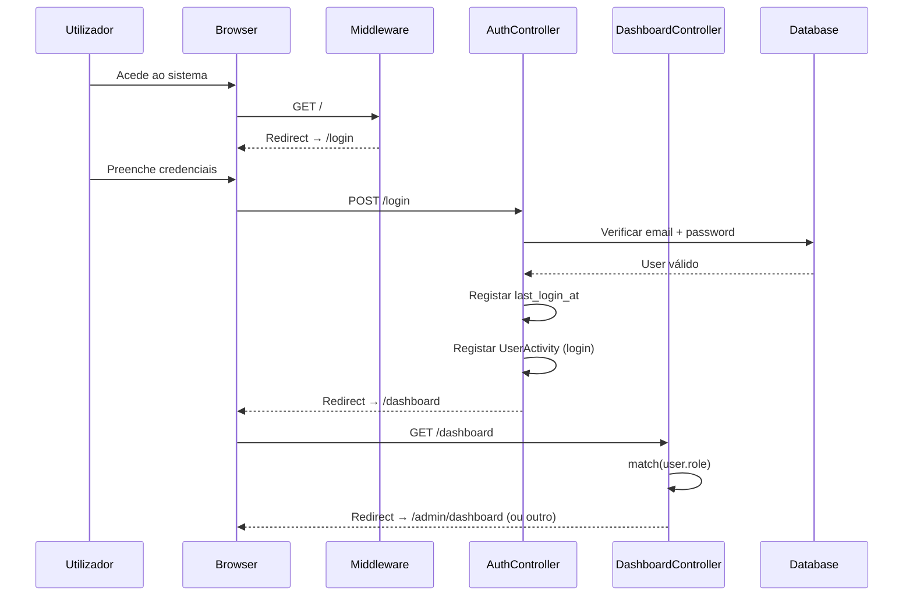

### Mapa de Redirecionamento por Role

| Role | Dashboard Destino | Route Name |
|------|------------------|------------|
| `super_admin` / `admin` / `pastor_senior` | `/admin/dashboard` | `dashboard.admin` |
| `pastor_zona` | `/pastor/dashboard` | `dashboard.pastor` |
| `supervisor` | `/supervisor/dashboard` | `dashboard.supervisor` |
| `lider_celula` | `/lider/dashboard` | `dashboard.lider` |
| `membro` | `/membro/dashboard` | `dashboard.membro` |
| `secretaria` | `/secretaria/dashboard` | `dashboard.secretaria` |
| `tesouraria` | `/financial-dashboard` | `financial.dashboard` |
| `comissao_obra` | `/project-edificar/dashboard` | `edificar.dashboard` |
| `responsavel_pacote` | `/admin/packages/dashboard` | `packages.dashboard` |
| `administracao` | `/administracao/dashboard` | `dashboard.administracao` |

---

## 2. Fluxo de Contribuições (Edificar)

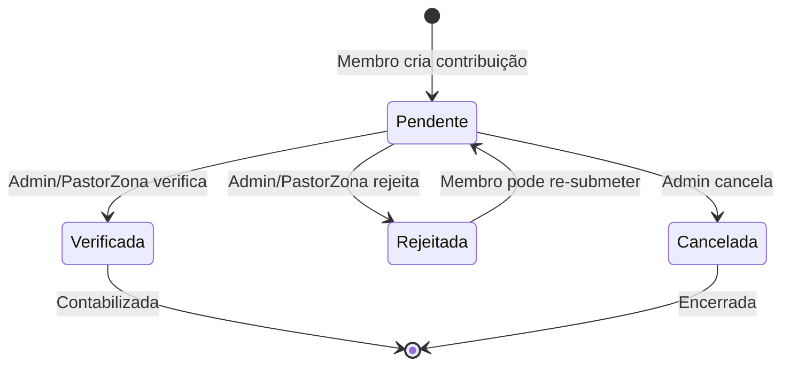

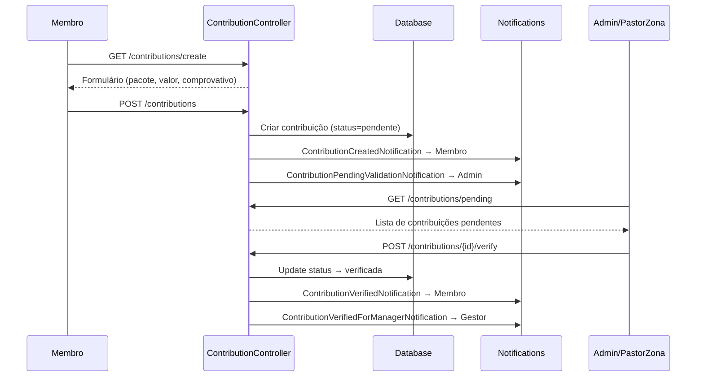

### Ciclo Financeiro

O sistema usa um **ciclo mensal personalizado** para contribuições: **dia 20 do mês até dia 5 do mês seguinte**. Isto é implementado em:

- `User::getTotalContributedThisMonth()`
- `Cell::getTotalContributedThisMonth()`
- `Zone::getTotalContributedThisMonth()`
- `Contribution::scopeThisMonth()`

---

## 3. Fluxo de Cultos (Services)

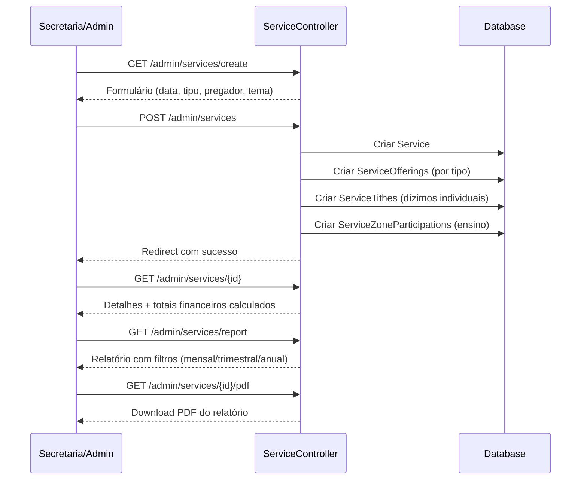

### Tipos de Culto

| Tipo | Código | Descrição |
|------|--------|-----------|
| 1º Culto | `1st` | Domingo manhã (1º) |
| 2º Culto | `2nd` | Domingo manhã (2º) |
| 3º Culto | `3rd` | Domingo tarde |
| 4º Culto | `4th` | Domingo noite |
| Especial | `special` | Cultos especiais |
| Ensino | `teaching` | Quarta-feira (com presenças por zona) |

---

## 4. Fluxo de Visitantes

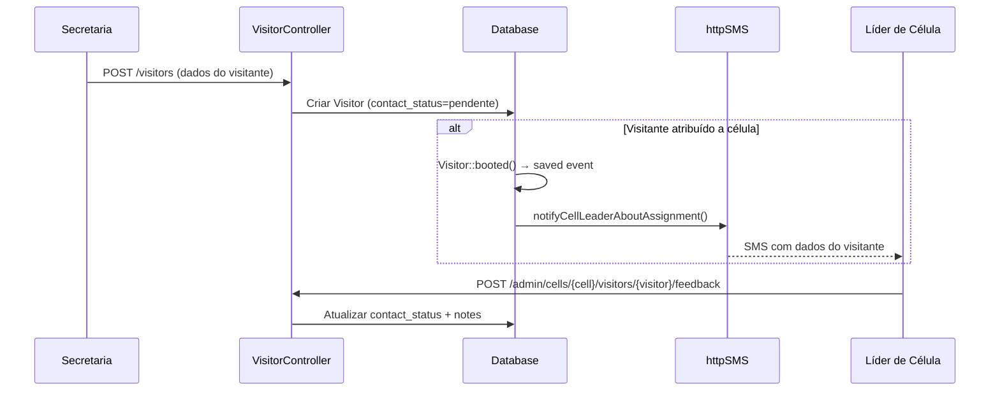

### Estados do Visitante

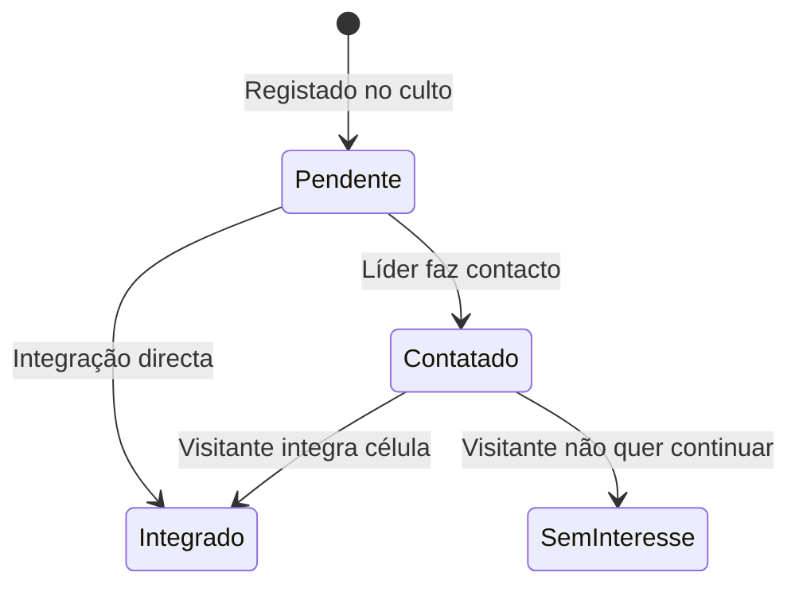

---

## 5. Fluxo de Gestão de Membros

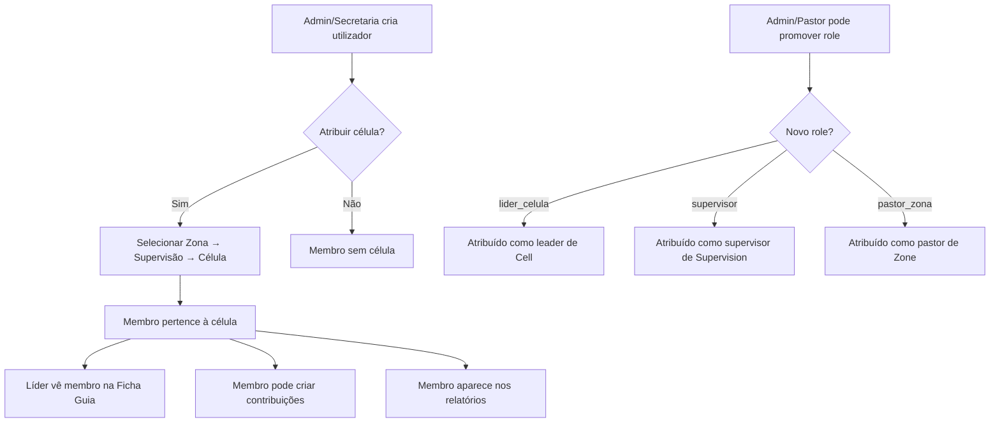

---

## 6. Fluxo da Hierarquia Eclesiástica

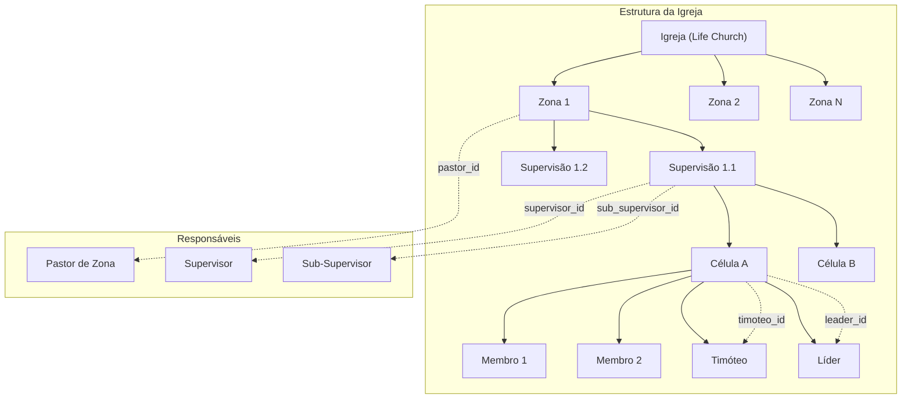

---

## 7. Fluxo de Relatórios Trimestrais

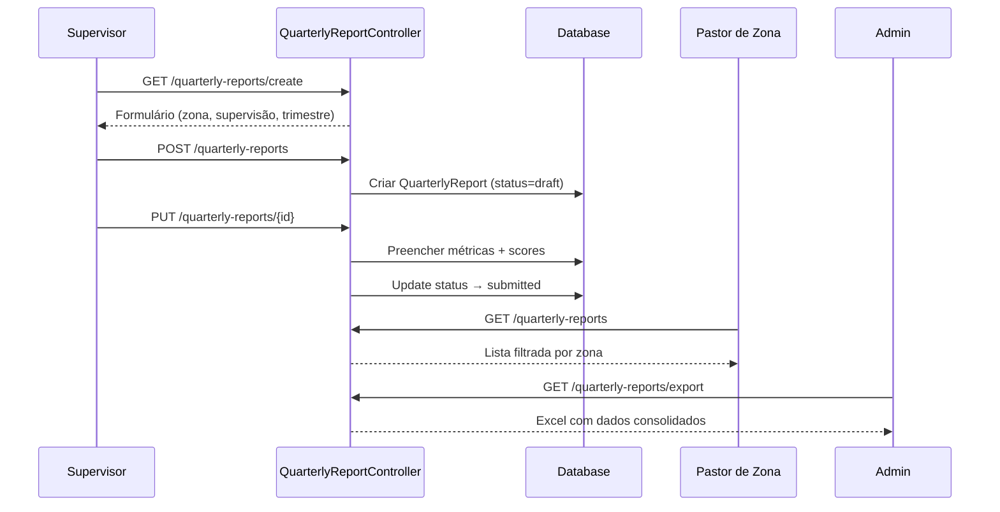

---

## 8. Fluxo da Escola Ministerial

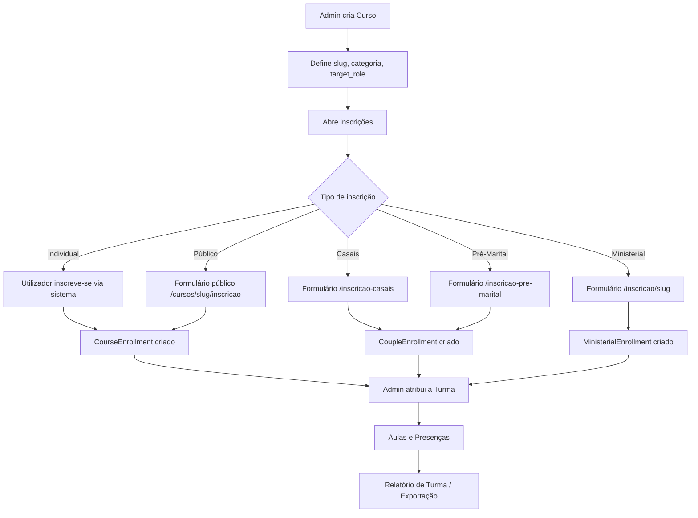

---

## 9. Fluxo de Eventos

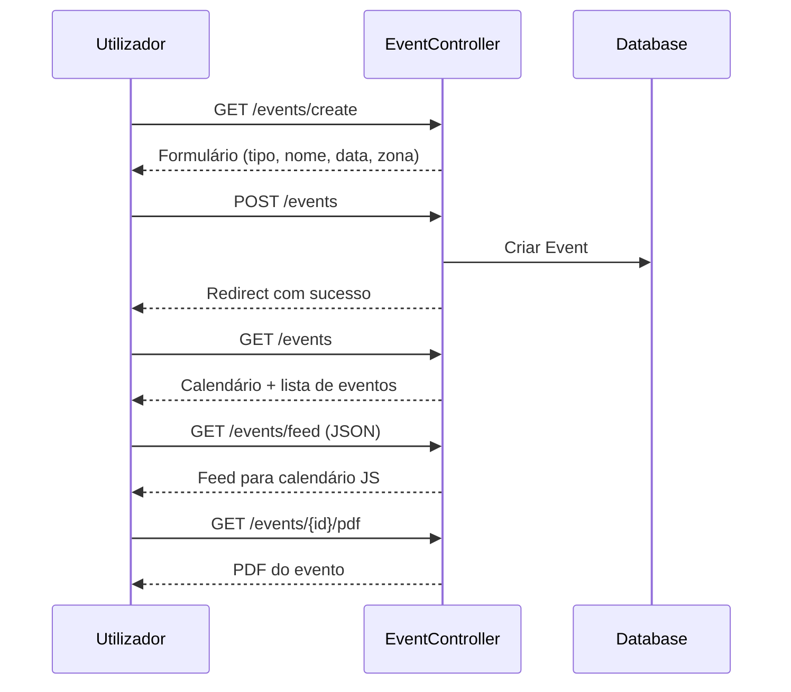

---

## 10. Fluxo do Painel Financeiro

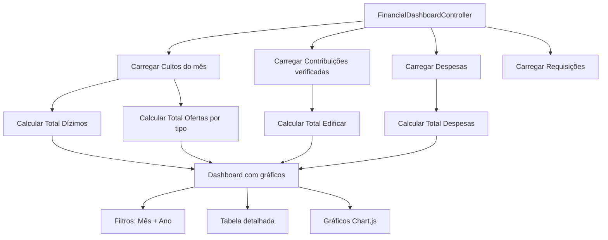

---

## 11. Fluxo de Notificações

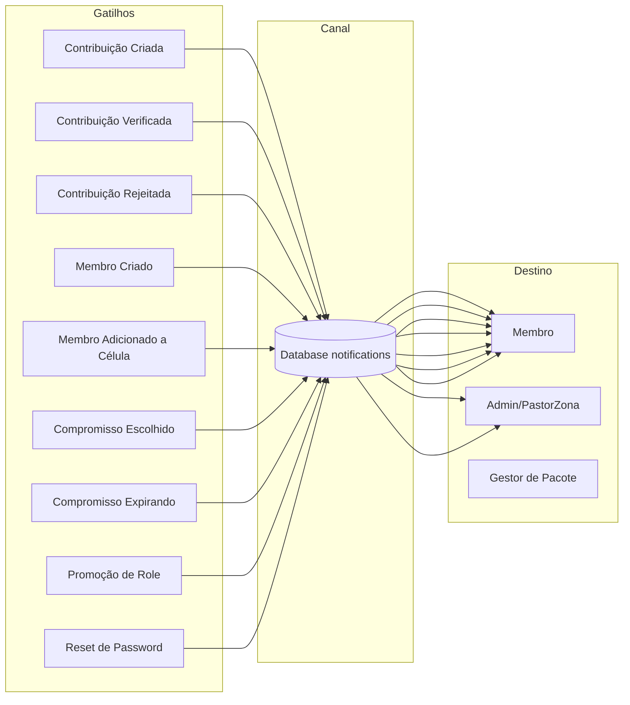

### Preferências de Notificação

Cada utilizador pode configurar quais notificações quer receber via `notification_preferences` (JSON):

| Preferência | Default |
|------------|---------|
| `contribution_created` | ✅ |
| `contribution_pending_validation` | ✅ |
| `pending_contributions` | ✅ |
| `contribution_verified` | ✅ |
| `contribution_rejected` | ✅ |
| `commitment_chosen` | ✅ |
| `commitment_expiring` | ✅ |
| `member_created` | ✅ |
| `member_added_to_cell` | ✅ |
| `user_promoted` | ✅ |

---

## 12. Fluxo do Setup Wizard

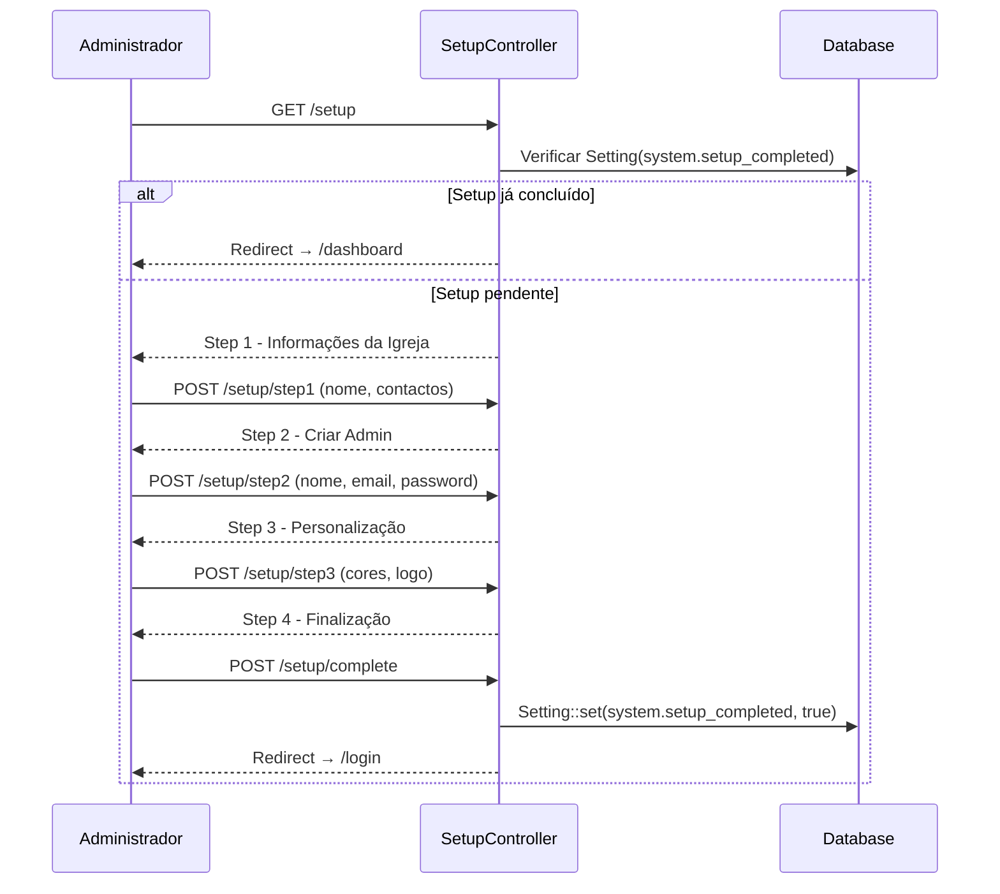
