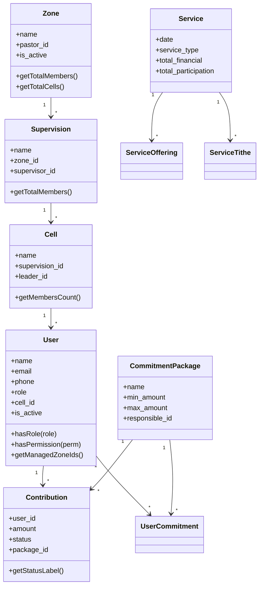

# MODELS — Life Church Management System

> **Data:** 2026-07-10 | **Total:** 36 Models + 2 Concerns

---

## Índice de Models

| # | Model | Ficheiro | Bytes | Domínio |
|---|-------|---------|-------|---------|
| 1 | User | User.php | 16.535 | Core |
| 2 | Zone | Zone.php | 3.046 | Hierarquia |
| 3 | Supervision | Supervision.php | 1.777 | Hierarquia |
| 4 | Cell | Cell.php | 2.614 | Hierarquia |
| 5 | Visitor | Visitor.php | 5.593 | Visitantes |
| 6 | Contribution | Contribution.php | 3.444 | Financeiro |
| 7 | CommitmentPackage | CommitmentPackage.php | 2.284 | Financeiro |
| 8 | UserCommitment | UserCommitment.php | 2.958 | Financeiro |
| 9 | Service | Service.php | 3.327 | Cultos |
| 10 | ServiceOffering | ServiceOffering.php | 567 | Cultos |
| 11 | ServiceTithe | ServiceTithe.php | 440 | Cultos |
| 12 | ServiceIndividualOffering | ServiceIndividualOffering.php | 461 | Cultos |
| 13 | ServiceZoneParticipation | ServiceZoneParticipation.php | 911 | Cultos |
| 14 | OfferingType | OfferingType.php | 604 | Cultos |
| 15 | CellMeeting | CellMeeting.php | 2.036 | Encontros |
| 16 | Attendance | Attendance.php | 608 | Encontros |
| 17 | CellVisitor | CellVisitor.php | 691 | Encontros |
| 18 | Discipleship | Discipleship.php | 513 | Discipulado |
| 19 | Conversion | Conversion.php | 596 | Discipulado |
| 20 | Event | Event.php | 992 | Eventos |
| 21 | EventType | EventType.php | 841 | Eventos |
| 22 | Wedding | Wedding.php | 394 | Eventos |
| 23 | Course | Course.php | 1.037 | Escola |
| 24 | CourseClass | CourseClass.php | 1.822 | Escola |
| 25 | CourseEnrollment | CourseEnrollment.php | 1.724 | Escola |
| 26 | CourseClassMeeting | CourseClassMeeting.php | 502 | Escola |
| 27 | CourseClassAttendance | CourseClassAttendance.php | 541 | Escola |
| 28 | CoupleEnrollment | CoupleEnrollment.php | 948 | Escola |
| 29 | MinisterialEnrollment | MinisterialEnrollment.php | 715 | Escola |
| 30 | QuarterlyReport | QuarterlyReport.php | 1.799 | Relatórios |
| 31 | QuarterlyReportEvent | QuarterlyReportEvent.php | 527 | Relatórios |
| 32 | Setting | Setting.php | 2.078 | Sistema |
| 33 | UserActivity | UserActivity.php | 1.851 | Sistema |
| 34 | InventoryItem | InventoryItem.php | 480 | Inventário |
| 35 | Requisition | Requisition.php | 1.071 | Financeiro Op. |
| 36 | Expense | Expense.php | 631 | Financeiro Op. |

---

## Concerns (Traits)

### `NormalizesMozPhone`
**Ficheiro:** [NormalizesMozPhone.php](file:///home/fdev-ms/Filipe/proj_edificar/app/Models/Concerns/NormalizesMozPhone.php)  
**Usado por:** `User`, `Visitor`  
**Função:** Normaliza telefones moçambicanos para formato padrão (9 ou 12 dígitos com prefixo 258).

### `LogsActivity`
**Ficheiro:** [LogsActivity.php](file:///home/fdev-ms/Filipe/proj_edificar/app/Models/Concerns/LogsActivity.php)  
**Usado por:** `User`  
**Função:** Regista actividades do utilizador na tabela `user_activities`.

---

## Models Detalhados

### 1. User (Model Central)

**Ficheiro:** [User.php](file:///home/fdev-ms/Filipe/proj_edificar/app/Models/User.php) — 490 linhas

**Traits:** HasFactory, Notifiable, NormalizesMozPhone, LogsActivity

**Fillable:** name, email, password, phone, role, cell_id, is_active, observations, notification_preferences, last_login_at, menu_permissions

**Casts:** email_verified_at→datetime, password→hashed, is_active→boolean, notification_preferences→array, last_login_at→datetime, menu_permissions→array

**Mutators:** `setPhoneAttribute` — normaliza telefone via `normalizeMozPhone()`

**Relacionamentos:**

| Relação | Tipo | FK | Model |
|---------|------|-----|-------|
| cell | belongsTo | cell_id | Cell |
| contributions | hasMany | user_id | Contribution |
| commitments | hasMany | user_id | UserCommitment |
| ledCells | hasMany | leader_id | Cell |
| assignedCell | belongsTo | cell_id | Cell |
| timoteoCells | hasMany | timoteo_id | Cell |
| supervisedSupervisions | hasMany | supervisor_id | Supervision |
| subSupervisedSupervisions | hasMany | sub_supervisor_id | Supervision |
| quarterlyReports | hasMany | supervisor_id | QuarterlyReport |
| preachedServices | hasMany | preacher_id | Service |
| managedPackages | hasMany | responsible_id | CommitmentPackage |
| courseEnrollments | hasMany | user_id | CourseEnrollment |

**Scopes:** `scopeActive` — filtra utilizadores activos

**Helpers (Role):** isAdmin, isSuperAdmin, isPastorSenior, isPastor, isPastorZona, isSupervisor, isSubSupervisor, isLider, isTimoteo, isSecretaria, isTesouraria, isEdificarManager, isComissaoObra, isResponsavelPacote, isAdministracao, hasRole

**Helpers (Permissões):** hasPermission — sistema de permissões granulares com fallback por role

**Helpers (Memoizados):** isLiderOfAnyCell, getFirstLedCell, getZoneId, getManagedZoneIds, getManagedSupervisionIds, getPendingContributionsCount

---

### 2. Zone

**Ficheiro:** [Zone.php](file:///home/fdev-ms/Filipe/proj_edificar/app/Models/Zone.php) — 112 linhas

| Relação | Tipo | Destino |
|---------|------|---------|
| supervisions | hasMany | Supervision |
| pastor | belongsTo | User (pastor_id) |
| cells | hasManyThrough | Cell via Supervision |
| contributions | hasMany | Contribution |
| quarterlyReports | hasMany | QuarterlyReport |
| events | hasMany | Event |

**Scopes:** `scopeForTeachingServices` — zonas visíveis em cultos de ensino

**Helpers:** getSupervisionsCount, getTotalCells, getTotalMembers, getTotalContributedThisMonth, members

---

### 3. Service

**Ficheiro:** [Service.php](file:///home/fdev-ms/Filipe/proj_edificar/app/Models/Service.php) — 114 linhas

| Relação | Tipo | Destino |
|---------|------|---------|
| preacher | belongsTo | User |
| offerings | hasMany | ServiceOffering |
| tithes | hasMany | ServiceTithe |
| individualOfferings | hasMany | ServiceIndividualOffering |
| zoneParticipations | hasMany | ServiceZoneParticipation |

**Accessors Computados:**

| Accessor | Cálculo |
|---------|---------|
| `total_offerings` | ofertas (excl. dízimos) + especiais + individuais |
| `total_tithes` | dízimos dedicados + ofertas tipo 1 |
| `total_individual_offerings` | soma de ofertas individuais |
| `total_financial` | total_offerings + total_tithes |
| `total_members` | adultos + crianças (ou por zona para teaching) |
| `total_visitors` | visitantes adultos + crianças |
| `total_participation` | membros + visitantes + salvações |

---

### 4. Contribution

**Ficheiro:** [Contribution.php](file:///home/fdev-ms/Filipe/proj_edificar/app/Models/Contribution.php) — 154 linhas

**Scopes:** pending, verified, rejected, canceled, thisMonth

**Helpers:** isPending, isVerified, isRejected, isCanceled, canBeEdited, getStatusLabel, getStatusColor

> **Inconsistência:** `scopePending` usa `'pending'` mas `scopeVerified` usa `'verificada'` — o sistema mistura inglês e português nos status.

---

### 5. Visitor

**Ficheiro:** [Visitor.php](file:///home/fdev-ms/Filipe/proj_edificar/app/Models/Visitor.php) — 217 linhas

**Observer inline (`booted`):** Envia SMS ao líder da célula quando visitante é atribuído.

**Scopes:** pending, contacted, integrated, byZone, byDateRange, recent

**Accessors:** full_info, status_badge (retorna HTML inline — **anti-padrão**)

---

### 6. Setting (Singleton Pattern)

**Ficheiro:** [Setting.php](file:///home/fdev-ms/Filipe/proj_edificar/app/Models/Setting.php) — 84 linhas

**Métodos estáticos:** get (com cache 1h), set (com invalidação), has, getByGroup, clearCache

> **Nota:** `clearCache()` faz `Cache::flush()` — limpa TODO o cache da aplicação, não apenas settings.

---

### 7. UserCommitment

**Ficheiro:** [UserCommitment.php](file:///home/fdev-ms/Filipe/proj_edificar/app/Models/UserCommitment.php) — 119 linhas

**Scopes:** active (sem end_date ou futuro)

**Helpers de campanha:** getTotalContributed, getCampaignStatus (pending/partial/paid/surplus), getSurplusAmount, getProgressPercentage, getTotalPending, getTotalCanceled

> **Nota:** Faz queries directas ao `Contribution` sem usar relações Eloquent — potencial N+1.

---

### 8. CellMeeting

**Ficheiro:** [CellMeeting.php](file:///home/fdev-ms/Filipe/proj_edificar/app/Models/CellMeeting.php) — 92 linhas

**Accessors:** meeting_type_label (normal, leadership, supervision, zone, general, other)

---

### 9. UserActivity

**Ficheiro:** [UserActivity.php](file:///home/fdev-ms/Filipe/proj_edificar/app/Models/UserActivity.php) — 75 linhas

**Accessors:** icon (Bootstrap Icon por action), badge_color (cor por action)

**Polimorfismo manual:** `subject()` usa `model_type::find(model_id)` — não usa `MorphTo` nativo do Laravel.

---

## Diagrama de Relações dos Models

