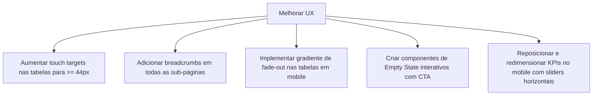

# UI & UX REPORT — Life Church Management System

> **Data:** 2026-07-10 | **Responsável:** Chief Digital Transformation Architect

---

## 1. Identidade Visual e Design System

O Portal Life Church utiliza uma abordagem estética moderna para sistemas SaaS eclesiásticos:

- **Paleta de Cores:** Curada com tons neutros (`bg-gray-50`/`bg-gray-100`) para a interface geral, realçada com a cor de destaque principal (Laranja `#F97316` / `orange-500`) que evoca calor e energia da marca Life Church.
- **Tipografia:**
  - **Outfit (Títulos):** Fonte com traços modernos e limpos, usada em títulos de páginas, cabeçalhos de secção e KPIs numéricos.
  - **Inter (Corpo):** Altamente legível em tabelas e formulários densos.
- **Painel Lateral (Sidebar):** Mantido em tom escuro profundo (`bg-slate-950` / `bg-black`) em todos os temas. Isto cria um contraste profissional e foco no conteúdo principal, alinhando-se com designs SaaS modernos (ex: Vercel, Linear).
- **Glassmorphism:** Uso moderado de transparências com desfoque de fundo (`backdrop-blur`) em modais e headers para dar uma sensação tridimensional e premium.

---

## 2. Responsividade (Mobile e Desktop)

### Adaptabilidade Mobile
- **Barra Lateral Mobile:** Oculta por padrão no mobile, sendo ativada por um botão hambúrguer no cabeçalho. Desliza a partir da esquerda usando transições do Alpine.js com um overlay escuro semi-transparente no fundo do ecrã.
- **Tabelas Responsivas:** A maioria das tabelas possui a class `.overflow-x-auto` para evitar a quebra do layout em ecrãs pequenos.
- **Grelhas de Cartões (Cards Grid):** Os dashboards mudam a estrutura de colunas de forma fluida (`grid-cols-1 md:grid-cols-2 lg:grid-cols-4`).

---

## 3. Avaliação de Acessibilidade e Usabilidade

### Pontos Fortes
- **Legibilidade de Inputs:** Os inputs premium possuem labels flutuantes e foco bem delimitado visualmente, auxiliando utilizadores com dificuldades de atenção.
- **Badges Semânticos:** Uso de cores semânticas padrão para estados (Verde para verificado, Âmbar para pendente, Vermelho para rejeitado) com ícones auxiliares (✓, ✗, Ø), garantindo a legibilidade para daltónicos.

---

## 4. Falhas Críticas de UX Identificadas

De acordo com o levantamento efetuado na auditoria e no checklist de UX, foram identificadas as seguintes falhas recorrentes no sistema:

> [!WARNING]
> ### Problemas Críticos a Corrigir
> 
> 1. **Ocultação de KPIs Críticos em Mobile:**
>    - O painel do administrador oculta métricas financeiras essenciais em ecrãs mobile para poupar espaço, forçando o administrador a usar um computador para obter dados rápidos.
> 
> 2. **Ausência de Indicadores de Scroll Lateral em Tabelas:**
>    - Nas listagens de contribuições e membros, as tabelas que excedem a largura do ecrã em mobile sofrem corte visual sem qualquer pista visual (ex: gradiente de desvanecimento ou ícone de scroll) que indique ao utilizador a possibilidade de deslizar lateralmente.
> 
> 3. **Áreas de Toque (Touch Targets) Demasiado Pequenas:**
>    - Os botões de ação em tabelas (editar, apagar, ver) utilizam apenas ícones pequenos sem padding suficiente. Em dispositivos móveis, isto resulta em toques errados frequentes (Touch Target inferior a 44x44px).
> 
> 4. **Falta de Estados Vazios (Empty States) Úteis:**
>    - Quando não existem dados (ex: sem contribuições pendentes, sem reuniões registadas), a interface exibe apenas textos simples como "Sem registos". Falta um Apelo à Ação (CTA) do género "Registar nova reunião" ou "Adicionar visitante".
> 
> 5. **Ausência de Breadcrumbs em Sub-páginas:**
>    - Ao navegar para detalhes profundos (ex: visualizar presenças de uma turma de um curso), o utilizador perde o contexto de navegação e é obrigado a usar o botão "Voltar" do navegador.

---

## 5. Recomendações de Melhoria (Roadmap Visual)

