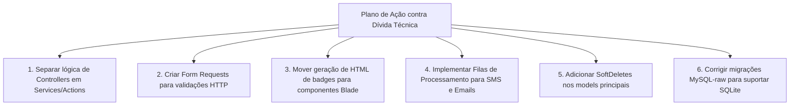

# TECHNICAL DEBT — Life Church Management System

> **Data:** 2026-07-10 | **Responsável:** Chief Digital Transformation Architect

---

## 1. Dívida de Arquitetura (Separation of Concerns)

### 1.1 Controllers Demasiado Grandes (Fat Controllers)
Vários controllers acumulam responsabilidades excessivas que deveriam ser delegadas a classes de serviço, actions ou jobs:
- [ServiceController](file:///home/fdev-ms/Filipe/proj_edificar/app/Http/Controllers/ServiceController.php) (~33KB): Gere logs de dízimos, agrupamento por tipo de oferta, presenças em cultos e exportações de PDFs/Excel.
- [ContributionController](file:///home/fdev-ms/Filipe/proj_edificar/app/Http/Controllers/Contribution/ContributionController.php) (~32KB): Implementa validações manuais de comprovativos e o fluxo completo de transição de estados.
- [PackageController](file:///home/fdev-ms/Filipe/proj_edificar/app/Http/Controllers/Admin/PackageController.php) (~28KB): Trata do processamento de links para WhatsApp, compilação de templates SMS e lógica de relatórios.

### 1.2 Ausência de Form Requests
A validação das requisições HTTP é realizada de forma inline dentro dos controllers:
```php
$request->validate([
    'name' => 'required|string|max:255',
    'date' => 'required|date',
    ...
]);
```
**Problema:** Isto duplica regras de validação (ex: regras para criação e edição de membros) e polui os métodos de ação dos controllers.

### 1.3 Acoplamento Visual nos Models (Anti-padrão)
O model `Visitor` contém o método `getStatusBadgeAttribute` que retorna HTML cru:
```php
return match ($this->contact_status) {
    'pendente' => '<span class="px-3 py-1 bg-yellow-50 text-yellow-600 rounded-full text-xs font-bold">Pendente</span>',
    ...
};
```
**Problema:** O design visual (classes Tailwind) fica acoplado ao modelo de dados do Eloquent. Se o tema visual mudar, é necessário alterar o código backend. Deveriam ser usadas views Blade parciais ou presenters.

---

## 2. Dívida de Base de Dados e Migrações

### 2.1 Incompatibilidade de Drivers de Teste (SQLite)
A migração [2026_02_17_102103_add_timoteo_role_to_users_table.php](file:///home/fdev-ms/Filipe/proj_edificar/database/migrations/2026_02_17_102103_add_timoteo_role_to_users_table.php) utiliza `ALTER TABLE ... MODIFY COLUMN` de forma crua.
- **Problema:** Impede o arranque de testes automáticos com SQLite em memória, quebrando a suite de testes.

### 2.2 Inconsistência nos Estados (Enums)
A tabela `contributions` define status como `enum('pendente', 'verificada', 'rejeitada')` (em português), mas no model `Contribution` os scopes e validações referem-se a `'pending'` (em inglês). 
- **Problema:** Causa falhas de persistência e confusão na leitura de código.

### 2.3 Ausência de Soft Deletes
Nenhuma entidade crucial (como `User`, `Cell`, `Supervision`, `Zone`) utiliza a trait `SoftDeletes`.
- **Problema:** A eliminação de uma célula ou utilizador é definitiva. Devido a chaves estrangeiras com `onDelete('restrict')` em tabelas como `contributions`, a tentativa de eliminar um utilizador com histórico financeiro resulta em erros de SQL do servidor (foreign key constraint violations).

---

## 3. Dívida de Infraestrutura e Integrações

### 3.1 Operações Externas Síncronas (Bloqueantes)
O envio de notificações SMS (via httpSMS) e e-mails de confirmação é realizado de forma síncrona dentro da execução do request HTTP principal:
- **Problema:** Se o servidor da httpSMS estiver lento ou temporariamente offline, o utilizador final experimentará tempos de carregamento de página muito elevados (ou erro 504 Gateway Timeout), e a transação na base de dados pode ficar bloqueada.

### 3.2 Limpeza de Cache Agresiva (`Cache::flush()`)
O método `Setting::clearCache()` chama `Cache::flush()`.
- **Problema:** Numa infraestrutura partilhada, este método limpa todas as sessões de utilizadores logados na aplicação, forçando-os a fazer login novamente apenas porque um administrador atualizou uma configuração.

---

## 4. Plano de Refatoração Recomendado


