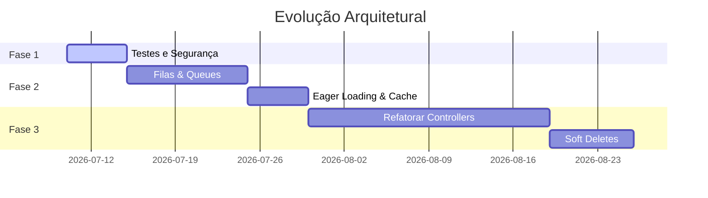

# ROADMAP — Life Church Management System

> **Data:** 2026-07-10 | **Responsável:** Chief Digital Transformation Architect

---

## 1. Fase 1: Correções Imediatas (Curto Prazo — Estabilização)

### 1.1 Correção dos Testes Automatizados (PHPUnit)
- **Ação:** Refatorar a migração do Timóteo (`2026_02_17_102103_add_timoteo_role_to_users_table.php`) e semelhantes para usar condicionais de driver (`DB::getDriverName() === 'mysql'`), permitindo que a base de dados SQLite em memória corra sem erros durante os testes.
- **Esforço:** Baixo.

### 1.2 Rate Limiting em Formulários Públicos
- **Ação:** Adicionar o middleware `throttle` (ex: `throttle:10,1` - 10 submissões por minuto) nas rotas de cadastro de casamentos, cursos e relatórios trimestrais públicos para prevenir ataques de spam.
- **Esforço:** Baixo.

---

## 2. Fase 2: Otimizações de Performance (Médio Prazo)

### 2.1 Processamento em Fila (Queues)
- **Ação:** Configurar a tabela de `jobs` na base de dados e migrar o envio de SMS (httpSMS) e e-mails para execução assíncrona.
- **Esforço:** Médio.

### 2.2 Eager Loading e Otimização de Dashboards
- **Ação:** Eliminar as queries N+1 identificadas no `AdminDashboardController` e no `UserCommitment` através da pré-carga de relações e contagens (`with` e `withCount`).
- **Esforço:** Médio.

### 2.3 Ajuste no Limpador de Cache
- **Ação:** Alterar o método `Setting::clearCache()` para expirar apenas chaves com prefixo `setting.` em vez de executar o `Cache::flush()` total, protegendo as sessões ativas dos utilizadores.
- **Esforço:** Baixo.

---

## 3. Fase 3: Qualidade de Código e Refatoração (Longo Prazo)

### 3.1 Refatoração de Controllers Monolíticos
- **Ação:** Extrair a lógica de cálculo financeiro e exportação de relatórios do `ServiceController` e `ContributionController` para classes de Action (Single Responsibility Pattern) e mover validações para Form Requests.
- **Esforço:** Alto.

### 3.2 Implementação de Soft Deletes
- **Ação:** Adicionar suporte a eliminação lógica (`SoftDeletes`) nos modelos `User`, `Cell`, `Supervision` e `Zone`, garantindo a integridade referencial nas tabelas de contribuições financeiras.
- **Esforço:** Médio.

### 3.3 Remoção de HTML de Models
- **Ação:** Transferir métodos de representação de ecrã (como `status_badge` no model `Visitor`) para componentes Blade ou classes Presenters dedicadas.
- **Esforço:** Baixo.
